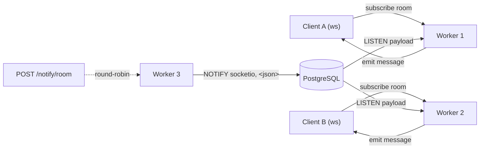
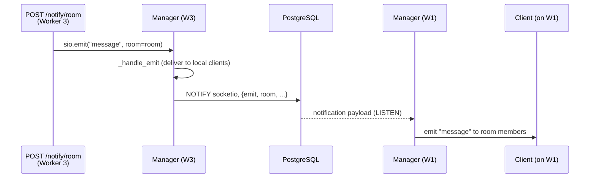
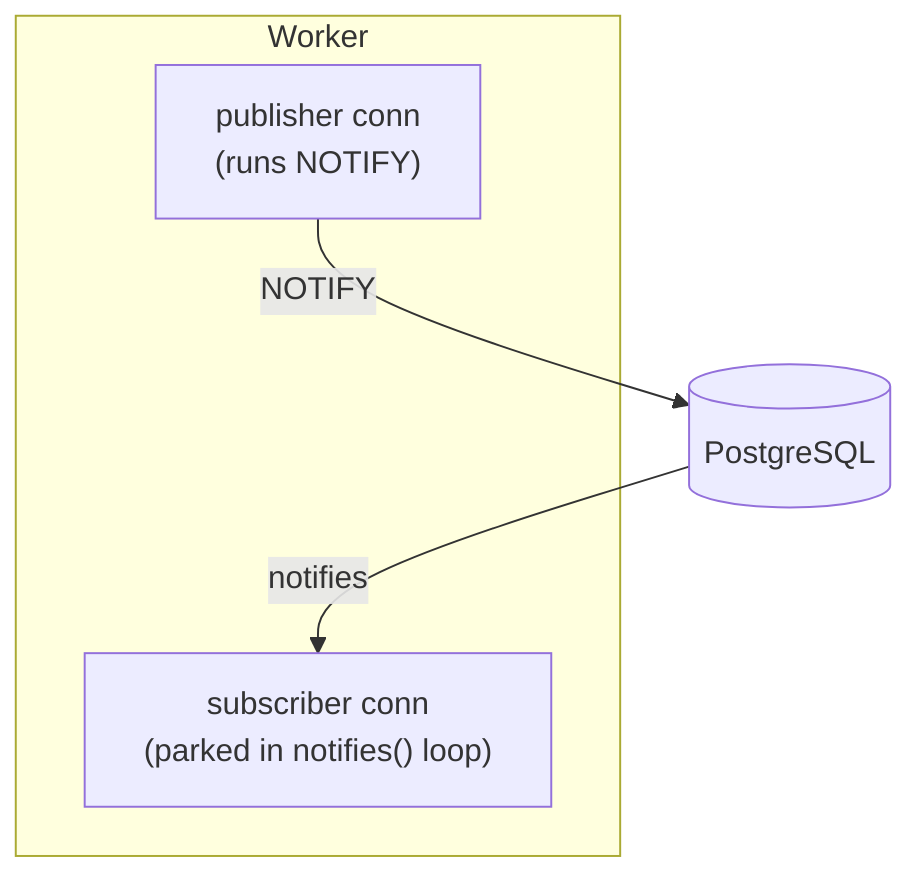

# socket-io-listen-notify

A proof of concept for horizontal Socket.IO fan-out across multiple workers,
using PostgreSQL `LISTEN`/`NOTIFY` as the pub/sub backend instead of Redis.

A message emitted from any worker reaches clients connected to any other worker,
with Postgres as the only shared piece of infrastructure.

## Why

### 1. Multiple workers means process isolation, with no shared memory

To serve real load the application runs under several Gunicorn workers, and each
worker is a separate OS process. They do not share RAM. An in-process pub/sub
built on the classic in-memory Observer pattern
([example](https://refactoring.guru/design-patterns/observer/python/example))
only notifies subscribers that live inside the same process, so it cannot fan a
message out to clients connected to a different worker. The fan-out must go
through something that every worker can reach.

### 2. Socket.IO over plain WebSocket

Socket.IO is more robust than a raw WebSocket for this use case. It provides
automatic reconnection, transport fallback (polling when WebSocket is
unavailable), rooms and channels, acknowledgements, and heartbeats.

### 3. Why not Redis

Socket.IO ships an official Redis pub/sub manager for Python, but Redis is not
always an option. There may be technical or operational constraints on adding
it, or the system may already run on Postgres with no other feature that needs
Redis. In that case introducing it only adds a new component and more
operational complexity.

### 4. No official Postgres adapter for the Python server

Socket.IO does provide an official Postgres adapter, but only for Node.js
([docs](https://socket.io/docs/v4/postgres-adapter/)). The Python server library
has no equivalent Postgres pub/sub manager, and the community libraries that do
exist no longer appear to be maintained. This POC implements a custom
`AsyncPubSubManager` over Postgres for the Python server, to validate that the
approach works.

## Architecture

A custom `PostgresPubSubManager` (a subclass of Socket.IO's `AsyncPubSubManager`)
publishes inter-worker messages with `NOTIFY` and consumes them with `LISTEN`.
Each worker owns its own dedicated connections.



Propagation of a single notification:



Each worker keeps two connections:



A connection parked in `notifies()` cannot run `NOTIFY` at the same time, since
that deadlocks. Publishing and subscribing therefore each get their own
connection.

### Layout

| Path | Responsibility |
| --- | --- |
| `app/api.py` | FastAPI app and routes; `socket_app` ASGI wrapper (Socket.IO and FastAPI) |
| `app/socket_server.py` | Socket.IO server, event handlers, manager wiring |
| `app/pub_sub_manager.py` | `PostgresPubSubManager` (NOTIFY/LISTEN over Socket.IO) |
| `app/listener.py` | `PgListener`, a thin LISTEN/NOTIFY wrapper over a connection |
| `app/db.py` | Connection pool and listener factory |
| `app/lifespan.py` | Opens and closes the connection pool |
| `app/config.py` | Settings from environment |

## Running

### Requirements

- [uv](https://docs.astral.sh/uv/)
- Docker (with Compose)
- [just](https://github.com/casey/just)

### Setup

```bash
cp .env.example .env
```

Adjust the values for your environment. On WSL, or if port 5432 is already in
use, set:

```dotenv
POSTGRES_PORT=5433
POSTGRES_HOST=localhost
```

### Commands

```bash
just infra    # start Postgres only (container)
just dev      # local API with autoreload, plus Postgres
just prod     # full production stack (Gunicorn, multiple workers) in Docker
just logs     # follow the production stack logs
just down     # stop the stack, keeping the volume
just clean    # stop the stack and delete the Postgres volume
```

To try it, connect a Socket.IO client, emit `subscribe` with a channel name,
then `POST /notify/<channel>` with `{"message": "..."}`. The client receives a
`message` event.

```bash
curl -X POST localhost:8000/notify/room \
  -H 'content-type: application/json' \
  -d '{"message": "hello"}'
```

The number of production workers is controlled by `API_WORKERS` in `.env`.

## Tests

```bash
just test     # or: uv run pytest
```

Tests spin up an ephemeral Postgres with Testcontainers, so no manual setup is
required. The main test, `tests/test_message_fan_out.py`, validates the core
goal:

1. it boots the application under Gunicorn with multiple workers;
2. it connects a Socket.IO client that subscribes to a channel;
3. it fires many concurrent `POST /notify` requests, which land on different
   workers (verified through the returned worker PID);
4. it asserts that every message reaches the client, regardless of which worker
   emitted it.
